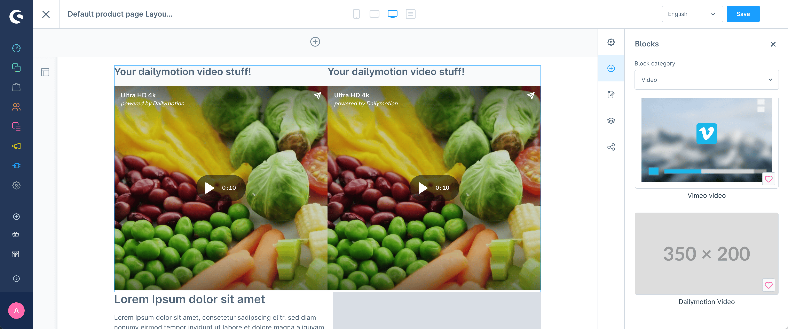

# Register CMS block

> Available since Shopware v6.6.1.0

With `cms.registerCmsBlock` you can register CMS blocks to use in the Shopping Experiences Module.



#### Usage:
```ts
cms.registerCmsBlock({
    name: 'dailymotion-dual-block',
    label: 'ex.cms.dailymotion.block.label',
    slots: [
        { element: 'dailymotionElement' },
        { element: 'dailymotionElement' },
    ],
    // optional properties
    category: 'video',
    previewImage: 'https://placehold.co/350x200',
    slotLayout: {
        grid: 'auto / auto auto'
    },
});
```

#### Parameters
| Name           | Required | Description                                                                                                                                                                                                                                                                                             |
| :------------- | :------- | :------------------------------------------------------------------------------------------------------------------------------------------------------------------------------------------------------------------------------------------------------------------------------------------------------ |
| `name`         | true     | The name of the cms block - Should have vendor prefix. It can be used in the Storefront for overriding the default layout.                                                                                                                                                                              |
| `label`        | true     | The label, which is visible when selecting the cms element - Use snippet keys here                                                                                                                                                                                                                      |
| `slots`        | true     | Array containing the slots. The content of the array are objects with the property "element" which refers to a real CMS element (can also be your own custom CMS elements).                                                                                                                             |
| `category `    | false    | The category of the CMS block. This is used to group the CMS blocks in the Shopping Experiences Module. You can use existing ones or create your own category. Then you need to provide a snippet for the category following this pattern: `apps.sw-cms.detail.label.blockCategory.${yourCategoryName}` |
| `previewImage` | false    | The URL of the preview image. This image is shown in the Shopping Experiences Module when selecting the CMS block.                                                                                                                                                                                      |
| `slotLayout`   | false    | The layout of the slots. This is used to define the grid layout of the slots. You can use the [CSS grid shorthand syntax](https://developer.mozilla.org/en-US/docs/Web/CSS/grid) here.                                                                                                                  |


## Storefront usage

The CMS block will render automatically in the Storefront without any additional work. It renders the block as a CSS grid with the slots as grid items and the grid shorthand syntax you provided in the `slotLayout` property.

If you want you can override the default layout by creating a new template file in your app. The file should be named `cms-block-app-renderer.html.twig` and should be placed in the `<your-app>/Resources/views/storefront/block` directory of your app folder. More details on how to customize the Storefront in your App can be found in this documentation: https://developer.shopware.com/docs/guides/plugins/apps/storefront/customize-templates.html

Inside this file you need to define the block layout and the slots. The block which needs to be created follows this naming pattern: `block_app_renderer_${yourBlockName}`. The `${yourBlockName}` is the name of the block you registered with `cms.registerCmsBlock` except that you need to replace the hyphens with underscores.

If you want to have multiple different templates for multiple different CMS blocks you can add new Twig blocks for each CMS block
in the same file.

Example:

```html



    <div>
        <h1>Your custom implementation</h1>

        {# Render each slot content #}
        
            

            <div>
                
            </div>
        
    </div>

```