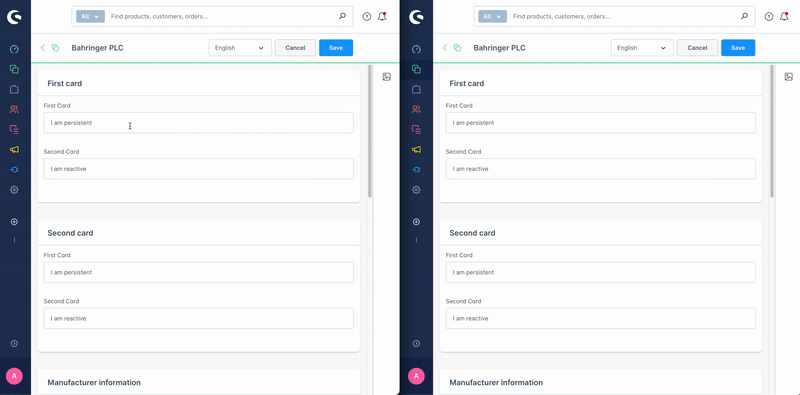

# useSharedState

The `composables.useSharedState` function allows you to create shared state across SDK locations. In practice, this means state that can be accessed across the different iframes your extension runs in inside the Shopware Administration. The state defined within this composable has a unique key, and any other part of the extension that uses the same key will access the same data.

The value stored within the shared state can be any data type that can be serialized to JSON. Additionally, we have added support for Entities and EntityCollections.

`useSharedState` solves a different problem than a normal Vue store:

- It synchronizes data between multiple SDK locations and iframes.
- It persists data in IndexedDB, so the state survives page reloads.
- It works without adding another dependency to your extension.
- It supports Shopware Entities and EntityCollections in addition to plain JSON data.

If your state only lives inside a single Vue application, Pinia is still a good fit. If the same extension renders in multiple locations, `useSharedState` keeps them in sync.



## Usage

```ts
// Inside a Vue component setup
import { composables } from "@shopware-ag/meteor-admin-sdk";
const { useSharedState } = composables;

const mySharedStateValue = useSharedState(
  "myUniqueKeyForTheSharedState",
  "myInitialDataValue",
);
```

## Parameters

| Name           | Required | Description                                                               |
| :------------- | :------- | :------------------------------------------------------------------------ |
| `key`          | true     | The unique key used to share the state across different places            |
| `initial data` | true     | The initial data value used when no data exists in the local shared state |

## Return value

Returns a reactive state object with a `value` property. Reading or updating `value` accesses the shared state for the given key across all matching SDK locations.
