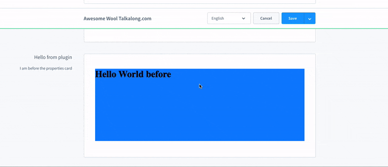

# Location

Locations define where extension code is executed inside the Shopware Administration.

Each location represents a specific UI context (for example a tab, modal, sidebar, or hidden entry point). Extensions typically check the current location before deciding which UI elements to register or which view to render.

```ts
import { location } from "@shopware-ag/meteor-admin-sdk";
```

## Prerequisites

See [Locations](../concepts/locations.md) for a full explanation of the concept.

## Location checks

### Check the current location ID

Check if the current location matches the given location ID:

```ts
if (location.is("my-location-id")) {
  // Render view for location
}
```

#### Parameters

| Name         | Required | Default | Description              |
| :----------- | :------- | :------ | :----------------------- |
| `locationId` | true     |         | The location ID to check |

#### Return value

Returns a boolean. It is `true` if the location ID matches the current location.

### Get the current location ID

Get the name of the current location ID:

```ts
const currentLocation = location.get();
```

#### Return value

Returns a string with the name of the current location.

### Check if current location is inside iFrame

Useful for hybrid extensions which are using plugin and Extension SDK functionalities together (Shopware 6.6 and lower). You can use this
check to separate code which should be executed inside the Extension SDK context and the plugin context.

```ts
if (location.isIframe()) {
  // Execute the code which uses the meteor-admin-sdk context
  import("./extension-code");
} else {
  // Execute the plugin code
  import("./plugin-code");
}
```

## iFrame heights

#### Parameters

No parameters needed.

#### Return value

Returns a boolean. Returns `true` if executed inside an iFrame.

### Update the height of the location iFrame

Update the height of the iFrame with this method:

```ts
location.updateHeight(750);
```

#### Parameters

| Name            | Required | Default        | Description                                                                                                    |
| :-------------- | :------- | :------------- | :------------------------------------------------------------------------------------------------------------- |
| `iFrame height` | false    | Auto generated | The height of the iFrame. If no value is provided it will be automatically calculated from the current height. |

#### Return value

This method does not have a return value.

### Start auto resizing of the iFrame height

This method starts the auto resizer of the iFrame height.



```ts
location.startAutoResizer();
```

#### Parameters

No parameters needed.

#### Return value

This method does not have a return value.

### Stop auto resizing of the iFrame height

This method stops the auto resizer of the iFrame height:

```ts
location.stopAutoResizer();
```

#### Parameters

No parameters needed.

#### Return value

This method does not have a return value.

## URL changes inside your app

> Available since Shopware v6.6.8.0

You can track and emit your URL changes only inside your own main module or settings page.

### Update URL

Send the current URL of your iFrame to the administration. When the user reloads the whole page your iFrame will get the
last page you sent to the administration:

```ts
const currentUrl = window.location.href;

location.updateUrl(new URL(currentUrl));
```

#### Parameters

| Name            | Required | Default | Description                           |
| :-------------- | :------- | :------ | :------------------------------------ |
| First parameter | true     |         | An URL object which contains your URL |

### Start automatic URL updates

To avoid manually sending URL changes, use this helper method that automatically sends changes in the URL to the
Administration:

```ts
location.startAutoUrlUpdater();
```

### Stop automatic URL updates

Stop automatic URL updaters by calling this method:

```ts
location.stopAutoUrlUpdater();
```
