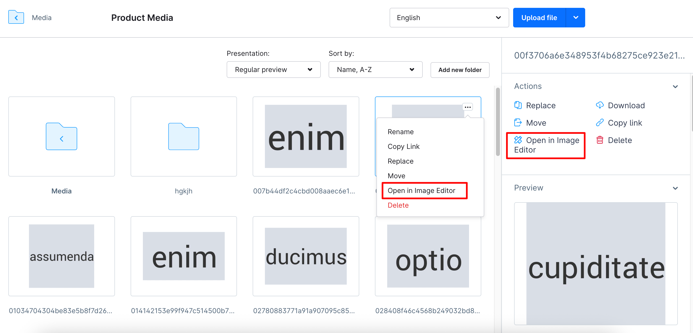

# Action button

#### Usage:
```ts
import { location, ui } from '@shopware-ag/meteor-admin-sdk';

if (location.is(sw.location.MAIN_HIDDEN)) {
    ui.actionButton.add({
        action: 'your-app_customer-detail-action',
        entity: 'customer',
        view: 'detail',
        label: 'Test action',
        callback: (entity, entityIds) => {
            // TODO: do something
        },
    });
}
```

#### Parameters
| Name                 | Required | Description                                                                                                |
| :------------------- | :------- | :--------------------------------------------------------------------------------------------------------- |
| `action`             | true     | A unique name of your action                                                                               |
| `entity`             | true     | The entity this action is for possible values: `product`, `order`, `category`, `promotion`, `customer` or `media`. Value `media` is available in Shopware version 6.7.1   |
| `view`               | true     | Determines if the action button appears on the listing or detail page, possible values: `detail`,`list` or item. View `item` is only used for entity `media` and in version 6.7.1 |
| `label`              | true     | The label of your action button                                                                            |
| `meteorIcon`         | false    | Meteor icon before label, will be available in Shopware version 6.7.4.0 . Check icon name on https://developer.shopware.com/resources/meteor-icon-kit/ |
| `fileTypes`          | false    | Media file types you want the action button to be displayed for. Will be available in Shopware version 6.7.6.                                          |
| `callback`           | true     | The callback function where you receive the entity and the entityIds for further processing                |

### Calling app actions
As an app developer you may want to receive the information of the callback function server side.
The following example will render the same action button as the above example but once it gets clicked you will receive a POST request to your app server.
**This will only work for apps. Plugin developers need to use a api client directly in there callback.**.

```ts
import { location, ui } from '@shopware-ag/meteor-admin-sdk';

if (location.is(sw.location.MAIN_HIDDEN)) {
    ui.actionButton.add({
        action: 'your-app_customer-detail-action',
        entity: 'customer',
        view: 'detail',
        label: 'Test action',
        callback: (entity /* "customer" */, entityIds /* ["..."] */) => {
            app.webhook.actionExecute({
                url: 'http://your-app.com/customer-detail-action',
                entityIds,
                entity,
            })
        },
    });
}
```

#### Example
- Add action button in customer detail page


```ts
ui.actionButton.add({
    action: 'your-app_customer-detail-action',
    entity: 'customer',
    view: 'detail',
    meteorIcon: 'regular-analytics',
    label: 'Test action',
    callback: (entity /* "customer" */, entityIds /* ["..."] */) => {
        app.webhook.actionExecute({
            url: 'http://your-app.com/customer-detail-action',
            entityIds,
            entity,
        })
    },
});
```

- Add action button in media item



```ts
ui.actionButton.add({
    action: 'test-media-button',
    entity: 'media',
    view: 'item',
    meteorIcon: 'regular-tools-alt',
    label: 'Open in Image editor',
    callback: (entity /* "media" */, entityIds /* ["..."] */) => {
        // TODO: Navigate to image editor app
    },
});
```