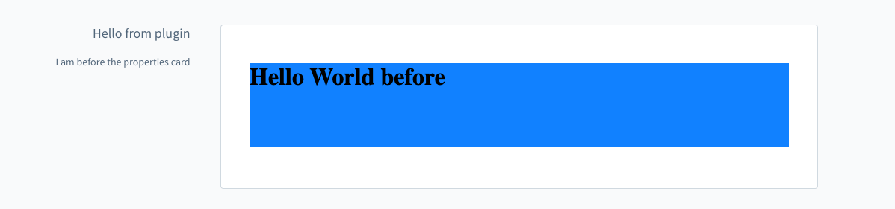
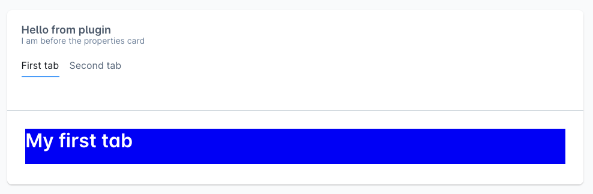

# Component Sections

Component sections allow extensions to render UI components inside existing Administration views. They are typically used together with tabs or other extension points that expose a `positionId`.

See the [Component Sections concept](../../concepts/component-sections.md) for an overview.

## Add

Add a new component to a component section.

### General usage

```ts
import { ui } from '@shopware-ag/meteor-admin-sdk';

ui.componentSection.add({
    component: 'the-component', // Choose the component which you want to render at the component section
    positionId: 'the-position-id-of-the-component-section', // Select the positionId where you want to render the component
    props: {
        ... // The properties are depending on the component
    }
})
```

### Parameters

| Name        | Required | Default | Description                                    |
| :---------- | :------- | :------ | :--------------------------------------------- |
| `component` | true     |         | Choose the component which you want to render. |

### Return value

This method does not have a return value.

## Available components

### Card

#### Properties

| Name         | Required | Default | Description                        |
|:-------------|:---------|:--------|:-----------------------------------|
| `title`      | false    |         | The main title of the card         |
| `subtitle`   | false    |         | The subtitle of the card           |
| `locationId` | true     |         | The locationId for the custom view |
| `tabs`       | false    |         | Render different content with tabs |

#### Usage

```js
import { ui } from '@shopware-ag/meteor-admin-sdk';

ui.componentSection.add({
    component: 'card',
    positionId: 'sw-product-properties__before',
    props: {
        title: 'Hello from plugin',
        subtitle: 'I am before the properties card',
        locationId: 'my-awesome-app-card-before'
    }
})
```

#### Example



#### With tabs

```js
import { ui } from '@shopware-ag/meteor-admin-sdk';

ui.componentSection.add({
    component: 'card',
    positionId: 'sw-product-properties__before',
    props: {
        title: 'Hello from plugin',
        subtitle: 'I am before the properties card',
        locationId: 'my-awesome-app-card-before',
        // Render tabs and custom tab content with the provided location id
        tabs: [
            {
                name: 'example-tab-1',
                label: 'First tab',
                locationId: 'example-tab-1'
            },
            {
                name: 'example-tab',
                label: 'Second tab',
                locationId: 'example-tab-2'
            }
        ],
    }
})
```

#### Example


