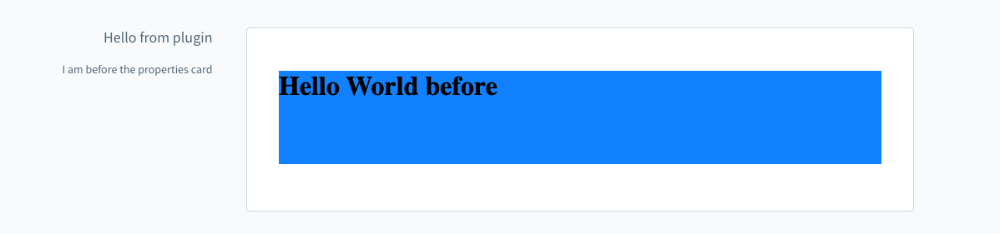
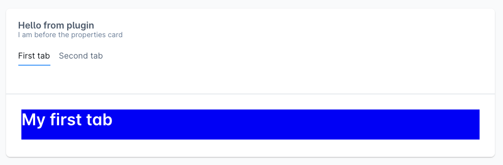

# Component Sections

Component sections allow extensions to render UI components inside existing Administration views. They are typically used together with tabs or other extension points that expose a `positionId`.

See the [Component Sections concept](../../concepts/component-sections.md) for an overview.

## componentSection.add()

Add a new component to a component section.

#### Usage

```ts
import { ui } from '@shopware-ag/meteor-admin-sdk';

ui.componentSection.add({
    component: 'the-component', // Choose the component which you want to render at the component section
    positionId: 'the-position-id-of-the-component-section', // Select the positionId where you want to render the component
    priority: 1, // Optional: control the render order when multiple extensions target the same positionId
    props: {
        ... // The properties are depending on the component
    }
})
```

#### Parameters

| Name         | Required | Default | Description                                                                                                                                                                                                                                                            |
| :----------- | :------- | :------ | :------------------------------------------------------------------------------------------------------------------------------------------------------------------------------------------------------------------------------------------------------------------- |
| `component`  | true     |         | Choose the component which you want to render.                                                                                                                                                                                                                        |
| `positionId` | true     |         | The `positionId` of the component section to render into.                                                                                                                                                                                                            |
| `priority`   | false    |         | Controls the render order when multiple extensions register a component at the same `positionId`. Available since Shopware v6.7.14.0. Lower values render first (`1` = topmost). Must be a positive number (`1` or higher); omitted or invalid values render after entries that set a `priority`. Sections registered by Shopware services always render above app sections. |
| `props`      | true     |         | The properties for the chosen component (see [Available components](#available-components)).                                                                                                                                                                          |

#### Return value

Returns a promise without data.

## Available components

### Card

##### Properties

| Name         | Required | Default | Description                        |
| :----------- | :------- | :------ | :--------------------------------- |
| `title`      | false    |         | The main title of the card         |
| `subtitle`   | false    |         | The subtitle of the card           |
| `locationId` | true     |         | The locationId for the custom view |
| `tabs`       | false    |         | Render different content with tabs |

#### Example: Add a component to the product page

```js
import { ui } from "@shopware-ag/meteor-admin-sdk";

ui.componentSection.add({
  component: "card",
  positionId: "sw-product-properties__before",
  props: {
    title: "Hello from plugin",
    subtitle: "I am before the properties card",
    locationId: "my-awesome-app-card-before",
  },
});
```



#### Example: Add tabs to the card

```js
import { ui } from "@shopware-ag/meteor-admin-sdk";

ui.componentSection.add({
  component: "card",
  positionId: "sw-product-properties__before",
  props: {
    title: "Hello from plugin",
    subtitle: "I am before the properties card",
    locationId: "my-awesome-app-card-before",
    // Render tabs and custom tab content with the provided location id
    tabs: [
      {
        name: "example-tab-1",
        label: "First tab",
        locationId: "example-tab-1",
      },
      {
        name: "example-tab-2",
        label: "Second tab",
        locationId: "example-tab-2",
      },
    ],
  },
});
```

To render the tabs introduced in this example, add matching entry points in your extension code using the `locationId` values that you freely chose when registering the component section. Read more about this pattern in [Locations](../../concepts/locations.md).

```js
import { location } from "@shopware-ag/meteor-admin-sdk";

if (location.is("example-tab-1")) {
  document.body.innerHTML = "<h1>First tab content</h1>";
}

if (location.is("example-tab-2")) {
  document.body.innerHTML = "<h1>Second tab content</h1>";
}
```


