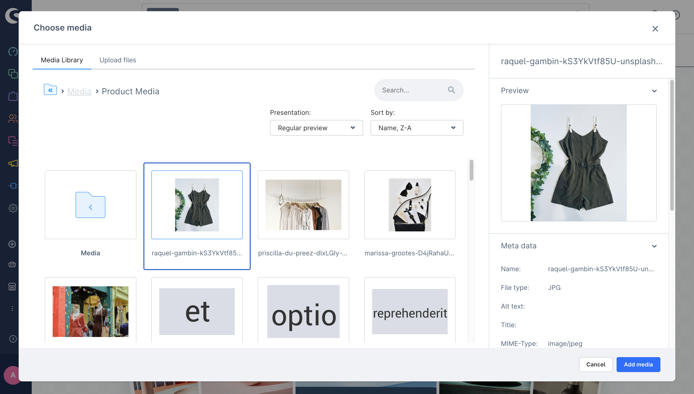
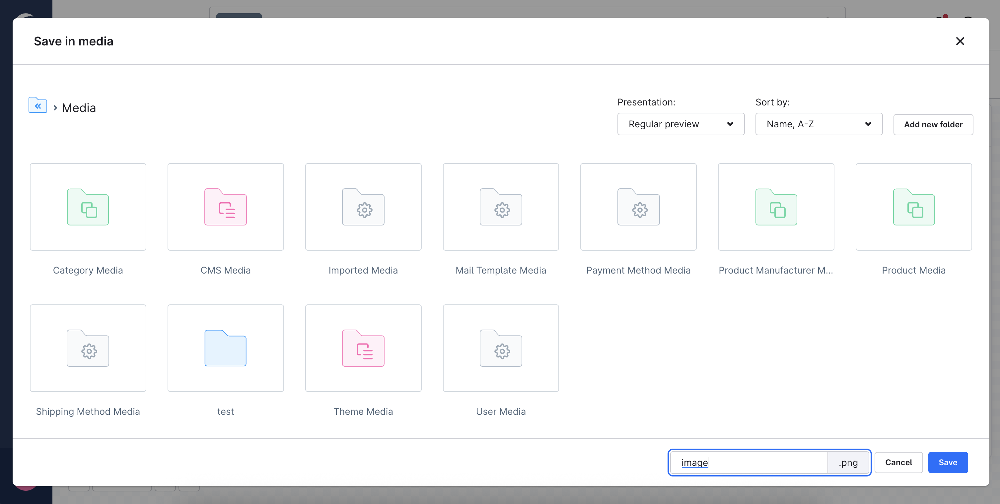

# Media modal

This method allows an app to interact with the Administration's media modal, which includes the Media modal and the Save media modal.

Functionality of each modal:
- The Media modal is used for selecting existing media from the media library or uploading new media. This functionality has been available since version 6.7.1.

- The Save media modal is used to choose a specific location to save the media, and this feature will be implemented in version 6.7.3.

## Media modal

### Open modal

Open media modal in the current view.

#### Usage:

```ts
ui.mediaModal.open({
  initialFolderId: "initialFolderId",
  allowMultiSelect: false,
  fileAccept: "image/png",
  selectors: ["fileName", "id", "url"],
  callback: ({ fileName, id, url }) => {},
});
```

#### Parameters

All parameters are similar to `sw-media-modal-v2` component's props

| Name               | Required | Default                   | Description                                                                          |
| :----------------- | :------- | :------------------------ | :----------------------------------------------------------------------------------- |
| `initialFolderId`  | false    | null                      | Initial folder id where the media modal will open                                    |
| `entityContext`    | false    | null                      | The entity name that upload image will be stored in that entity folder in Upload tab |
| `allowMultiSelect` | false    | true                      | Define single or multiple selection                                                  |
| `defaultTab`       | false    | library                   | Defines which tab should be opened by default                                        |
| `fileAccept`       | false    | image/\*                  | Define the file types which are allowed to be uploaded in Upload tab                 |
| `selectors`        | false    | ['fileName', 'id', 'url'] | Selected properties which should be returned in callback function                    |
| `callback`         | true     |                           | Callback function which will be called once the media item is selected.              |

#### Example



```ts
ui.mediaModal.open({
  initialFolderId: "productMediaFolderId",
  allowMultiSelect: false,
  selectors: ["fileName", "id", "url"],
  callback: ({ fileName, id, url }) => {},
});
```

## Save media modal

### Open save media modal

Open save media modal in the current view.

#### Usage:

```ts
ui.mediaModal.openSaveMedia({
  initialFolderId: "initialFolderId",
  initialFileName: "New Image",
  fileType: "png",
  callback: ({ fileName, folderId }) => {},
});
```

#### Parameters

All parameters are similar to `sw-media-save-modal` component's props

| Name               | Required | Default                   | Description                                                                          |
| :----------------- | :------- | :------------------------ | :----------------------------------------------------------------------------------- |
| `initialFolderId`  | false    | null                      | Initial folder id where the media modal will open                                    |
| `initialFileName`  | false    | null                      | Initial file name of media to set as initial value of file name input                                    |
| `fileType`  | false    | null                      | File extension of media to display on file name input's suffix                                    |
| `callback`         | true     |                           | This callback function is triggered when the "Save media" button is clicked. It returns the updated file name and the folderId where the media is stored.              |

#### Example



```ts
ui.mediaModal.openSaveMedia({
  initialFileName: "images",
  fileType: "png",
  callback: ({ fileName, folderId }) => {},
});
```
