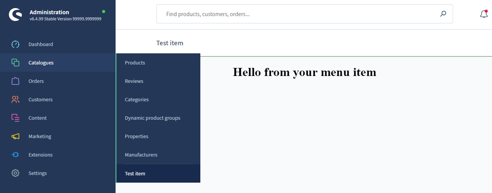

# Menu

Menu items allow extensions to add navigation entries to existing areas of the Shopware Administration menu.

They are typically used to expose extension functionality inside existing admin modules. In practice, this refers to the left sidebar navigation of the Administration.

```ts
import { ui } from "@shopware-ag/meteor-admin-sdk";
```

## collapseMenu()

> Available since Shopware v6.6.2.0

Collapse the Administration menu.

#### Usage

```ts
ui.menu.collapseMenu();
```

#### Parameters

This method does not accept parameters.

#### Return value

Returns a promise without data.

## expandMenu()

> Available since Shopware v6.6.2.0

Expand the Administration menu again after it has been collapsed.

#### Usage

```ts
ui.menu.expandMenu();
```

#### Parameters

This method does not accept parameters.

#### Return value

Returns a promise without data.

## addMenuItem()

Add a new menu item to the Shopware admin menu. The content of the menu item module is determined by your `locationId`.
A specific view or a set of actions can be triggered based on the `locationId`.

#### Usage

```ts
ui.menu.addMenuItem({
  label: "Test item",
  locationId: "your-location-id",
  displaySearchBar: true,
  displaySmartBar: true,
  parent: "sw-catalogue",
});
```

#### Parameters

| Name               | Required | Default        | Description                                                   |
| :----------------- | :------- | :------------- | :------------------------------------------------------------ |
| `label`            | true     |                | The label of the tab bar item                                 |
| `locationId`       | true     |                | The id for the content of the menu item module                |
| `displaySearchBar` | false    | true           | Toggles the sw-page search bar on/off                         |
| `displaySmartBar`  | false    | true           | Toggles the sw-page smart bar on/off                          |
| `parent`           | false    | 'sw-extension' | Determines under which main menu entry your item is displayed |
| `position`         | false    | 110            | Determines the position of your menu item                     |

#### Return value

Returns a promise without data.

#### Example



```ts
import { location, ui } from "@shopware-ag/meteor-admin-sdk";

// General commands
if (location.is(location.MAIN_HIDDEN)) {
  // Add the menu item to the catalogue module
  ui.menu.addMenuItem({
    label: "Test item",
    displaySearchBar: true,
    displaySmartBar: true,
    locationId: "your-location-id",
    parent: "sw-catalogue",
  });
}

// Render your custom view
if (location.is("your-location-id")) {
  document.body.innerHTML =
    '<h1 style="text-align: center">Hello from your menu item</h1>';
}
```
