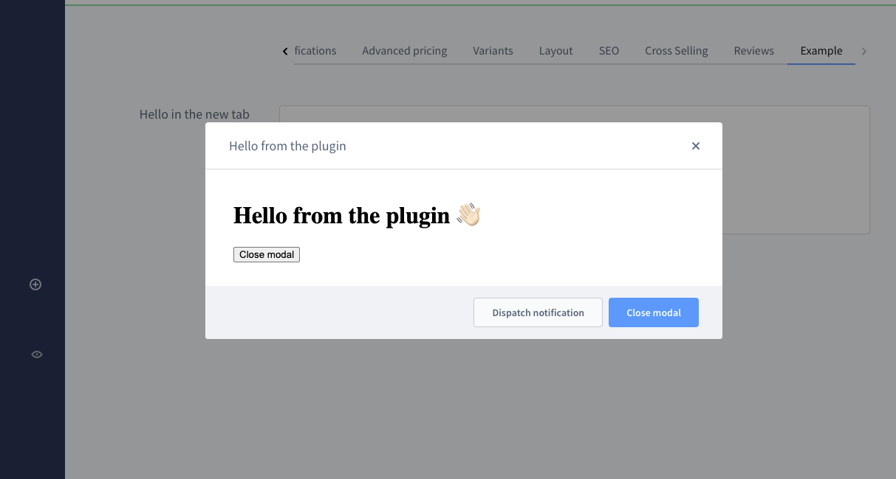

# Modals

A modal can be displayed in front of all other elements. To return to the main content the user must engage
with the modal by completing an action or by closing it. It should be mainly opened when the user interacts with something.
We recommend that no modal gets opened without context. As an example, it would be bad practice if the user gets logged
in and directly see some modals (e.g. changelogs of extensions) which all need to be closed manually.

### Open modal
Open a new modal in the current view. The content of the modal is determined by your `locationId` or by using plain text with `textContent`.

#### Usage:
```ts
ui.modal.open({
    title: 'Your modal title',
    // Use locationId for rendering custom content inside modal
    locationId: 'your-location-id',
    // Use textContent when no locationId is needed
    textContent: 'Do you really want to dispatch a notification?',
    variant: 'large',
    showHeader: true,
    showFooter: false,
    closable: true,
    buttons: [
        {
            label: 'Dispatch notification',
            method: () => {
                notification.dispatch({
                    message: 'Hello from the modal',
                    title: 'Modal example'
                })
            }
        },
        {
            label: 'Close modal',
            variant: 'primary',
            method: () => {
                ui.modal.close({
                    locationId: 'your-location-id'
                })
            }
        }
    ],
})
```

#### Parameters
| Name          | Required | Default   | Description                                                                                    | Available at Shopware |
|:--------------|:---------|:----------|:-----------------------------------------------------------------------------------------------|:----------------------|
| `title`       | true     |           | The title of the modal                                                                         |                       |
| `locationId`  | false    |           | The id for the content of the modal. If not provided it will render the `textContent`          |                       |
| `textContent` | false    |           | The plain text content of the modal. Will only be rendered if no `locationId` is given         | v.6.7.1               |
| `variant`     | false    | 'default' | Determine the size of the modal. Possible values are 'default', 'small', 'large' and 'full'    |                       |
| `showHeader`  | false    | true      | Enable the header in the modal which contains the title                                        |                       |
| `showFooter`  | false    | true      | Enable the modal footer                                                                        | v6.5.8                |
| `closable`    | false    | true      | If this is set to `false` then the modal can only be closed programmatically                   |                       |
| `buttons`     | false    | []        | This array contains button configurations which will render buttons in the footer of the modal |                       |

#### Example

```ts
ui.modal.open({
    title: 'Hello from the plugin',
    locationId: 'my-awesome-app-hello-world-modal',
    buttons: [
        {
            label: 'Dispatch notification',
            method: () => {
                notification.dispatch({
                    message: 'Hello from the modal',
                    title: 'Modal plugin'
                })
            }
        },
        {
            label: 'Close modal',
            variant: 'primary',
            method: () => {
                ui.modal.close({
                    locationId: 'my-awesome-app-hello-world-modal'
                })
            }
        }
    ]
})
```

### Update modal
> Available since Shopware 6.7.1.0

Updates an existing modal with the given `locationId`. This can be used to modify the modal's properties after it has been opened, such as changing the title, buttons, or visibility of header/footer from inside the modal.

#### Usage:
```ts
ui.modal.update({
    locationId: 'your-location-id',
    title: 'Updated modal title',
    showHeader: true,
    showFooter: true,
    closable: true,
    buttons: [
        {
            label: 'New button',
            method: () => {
                // Your method here
            }
        }
    ]
})
```

#### Parameters
| Name         | Required | Default | Description                                                                                    |
|:-------------|:---------|:--------|:-----------------------------------------------------------------------------------------------|
| `locationId` | true     |         | The id of the modal which should be updated                                                    |
| `title`      | false    |         | The new title of the modal                                                                     |
| `showHeader` | false    |         | Enable or disable the header in the modal                                                      |
| `showFooter` | false    |         | Enable or disable the modal footer                                                             |
| `closable`   | false    |         | If set to `false` then the modal can only be closed programmatically                           |
| `buttons`    | false    |         | Array of button configurations which will render buttons in the footer of the modal            |

### Close modal
Closes an opened modal. You need use the correct `locationId` of the modal which should get closed. If you don't provide a `locationId` the last modal without a `locationId` gets closed.

#### Usage:
```ts
ui.modal.close({ locationId: 'your-location-id' })
```

#### Parameters
| Name         | Required | Default | Description                                                                                                               |
|:-------------|:---------|:--------|:--------------------------------------------------------------------------------------------------------------------------|
| `locationId` | false    |         | The locationId of the modal which should get closed. If not provided, the last modal without a locationId will be closed. |
