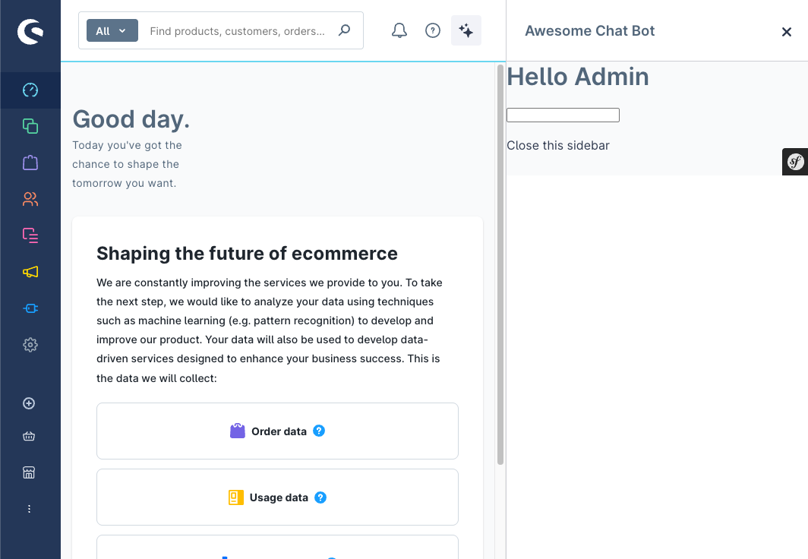

# Sidebars

A sidebar provides a contextual panel that displays at the right edge of the Administration window. Unlike modals, sidebars allow users to view and interact with additional content or functionality without losing context of the main interface. Sidebars should be opened in response to user interaction rather than appearing automatically. As a best practice, avoid opening sidebars without clear user context - for example, automatically displaying extension changelog sidebars immediately after login creates a poor user experience by requiring manual dismissal of each one.

### Add a sidebar

Add a new sidebar. The content of the sidebar is determined by your `locationId`.

#### Usage:

```ts
sw.ui.sidebar.add({
    title: 'Awesome Chat Bot',
    locationId: 'sidebar-chat-bot',
    icon: 'regular-sparkles',
});
```

#### Parameters
| Name | Required | Description | Available at Shopware |
| :----------- | :------- | :--------------------------------------------------------------------------------------------------------------------------------------------- | :---------------------|
| `title` | true | The title of the sidebar | 6.7 |
| `locationId` | true | The id for the content of the sidebar | 6.7 |
| `icon` | true | The icon to display in the sidebar. You can use any icon from the Shopware icon library | 6.7 |

#### Example


### Close a sidebar

Close an existing sidebar programmatically.

#### Usage:

```ts
sw.ui.sidebar.close({
    locationId: 'sidebar-chat-bot',
});
```

#### Parameters
| Name | Required | Description | Available at Shopware |
| :----------- | :------- | :--------------------------------------------------------------------------------------------------------------------------------------------- | :---------------------|
| `locationId` | true | The id of the sidebar to close | 6.7 |

### Remove a sidebar

Remove a sidebar completely from the DOM.

#### Usage:

```ts
sw.ui.sidebar.remove({
    locationId: 'sidebar-chat-bot',
});
```

#### Parameters
| Name | Required | Description | Available at Shopware |
| :----------- | :------- | :--------------------------------------------------------------------------------------------------------------------------------------------- | :---------------------|
| `locationId` | true | The id of the sidebar to remove | 6.7 |