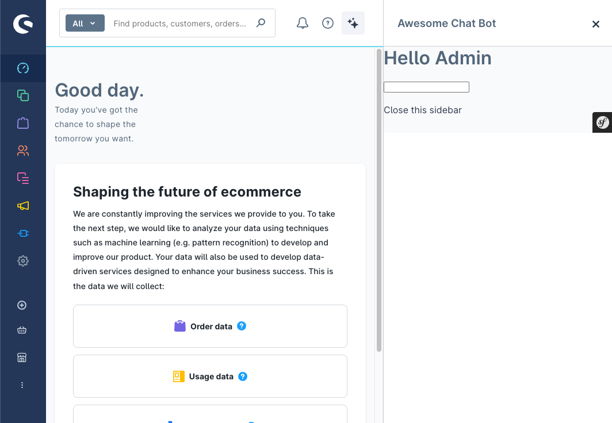

# Sidebars

A sidebar provides a contextual panel that displays at the right edge of the Administration window. Unlike modals, sidebars allow users to view and interact with additional content or functionality without losing context of the main interface. You can open a sidebar programmatically, not only from direct UI clicks. As a best practice, still tie openings to clear user or application context: stacking many sidebars without a reason forces repeated dismissal and harms the experience.

### Add a sidebar

Add a new sidebar. The content of the sidebar is determined by your `locationId`.

#### Usage:

```ts
sw.ui.sidebar.add({
    title: 'Awesome Chat Bot',
    locationId: 'sidebar-chat-bot',
    icon: 'regular-sparkles',
});
```

#### Parameters
| Name | Required | Description | Available at Shopware |
| :----------- | :------- | :--------------------------------------------------------------------------------------------------------------------------------------------- | :---------------------|
| `title` | true | The title of the sidebar | 6.7 |
| `locationId` | true | The id for the content of the sidebar | 6.7 |
| `icon` | true | The icon to display in the sidebar. You can use any icon from the Shopware icon library | 6.7 |
| `resizable` | false | Enables horizontal resizing of the sidebar | 6.7.2.0 |

#### Example


### Close a sidebar

Close an existing sidebar programmatically.

#### Usage:

```ts
sw.ui.sidebar.close({
    locationId: 'sidebar-chat-bot',
});
```

#### Parameters
| Name | Required | Description | Available at Shopware |
| :----------- | :------- | :--------------------------------------------------------------------------------------------------------------------------------------------- | :---------------------|
| `locationId` | true | The id of the sidebar to close | 6.7 |

### Remove a sidebar

Remove a sidebar completely from the DOM.

#### Usage:

```ts
sw.ui.sidebar.remove({
    locationId: 'sidebar-chat-bot',
});
```

#### Parameters
| Name | Required | Description | Available at Shopware |
| :----------- | :------- | :--------------------------------------------------------------------------------------------------------------------------------------------- | :---------------------|
| `locationId` | true | The id of the sidebar to remove | 6.7 |

### Active a sidebar

Active a sidebar that was already registered with [`add`](#add-a-sidebar). Use this when the sidebar exists but is closed or not in front. The Administration shows the panel for the given `locationId` and loads the content you associated with that id.

#### Usage:

```ts
sw.ui.sidebar.active({
    locationId: 'sidebar-chat-bot',
});
```

#### Parameters
| Name | Required | Description | Available at Shopware |
| :----------- | :------- | :--------------------------------------------------------------------------------------------------------------------------------------------- | :---------------------|
| `locationId` | true | The id of the sidebar to active | 6.7.9 |