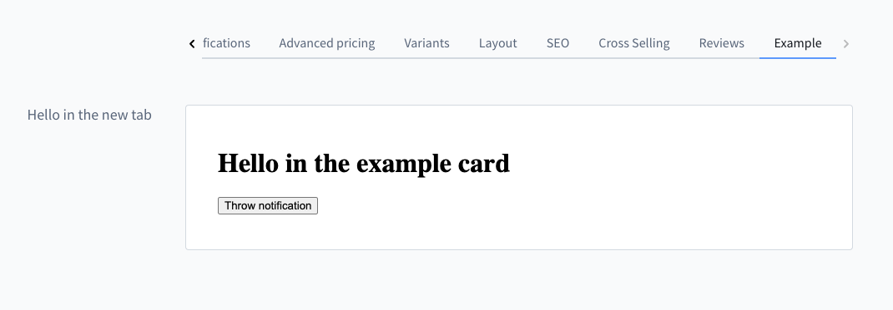

# Tabs

Tabs allow extensions to add additional tabs to existing Administration pages.

They are commonly used to extend entity detail pages such as products, customers, or orders.

## addTabItem()

Add a new tab item to an existing tab bar. The content of the new tab item
contains a component section. This works with tab bar's which have routing and
also static tab bars. If the tab bar has routing then the route for the tab item
will be generated automatically.

#### Usage

```ts
import { ui } from '@shopware-ag/meteor-admin-sdk';

ui.tabs('sw-product-detail' /* The positionId of the tab bar*/).addTabItem({
    label: 'Example tab',
    componentSectionId: 'example-product-detail-tab-content'
})
```

#### Parameters

| Name                 | Required | Default | Description                                                                                                                          |
| :------------------- | :------- | :------ | :--------------------------------------------------------------------------------------------------------------------------------- |
| `label`              | true     |         | The label of the tab bar item                                                                                                       |
| `componentSectionId` | true     |         | The Id for for the component section in the tab content                                                                             |
| `visible`            | false    | `true`  | Whether the tab item is shown. Set to `false` to hide the tab; omit (or `true`) to show it.                                         |

#### Conditional visibility

The tab is registered once (globally), so use `visible` to control whether it is shown for the
current context. Re-send `addTabItem` for the same `componentSectionId` with a new `visible` value
to toggle the tab - the Administration upserts by `componentSectionId` instead of adding a duplicate.
This lets an extension register a tab hidden and reveal it only when relevant (for example, based on
the entity that is currently opened).

```ts
import { ui } from '@shopware-ag/meteor-admin-sdk';

// Register the tab hidden.
ui.tabs('sw-order-detail').addTabItem({
    label: 'Example tab',
    componentSectionId: 'example-order-detail-tab-content',
    visible: false,
});

// Later, reveal it for the current context (upserted by componentSectionId).
ui.tabs('sw-order-detail').addTabItem({
    label: 'Example tab',
    componentSectionId: 'example-order-detail-tab-content',
    visible: true,
});
```

#### Return value

Returns a promise without data.

#### Example


```ts
import { location, notification, ui } from '@shopware-ag/meteor-admin-sdk';

// For general commands
if (location.is(location.MAIN_HIDDEN)) {
    // Add tab bar item
    ui.tabs('sw-product-detail').addTabItem({
        label: 'Example',
        componentSectionId: 'my-awesome-app-example-product-view'
    })

    // Add component to the new created section
    ui.componentSection.add({
        component: 'card',
        positionId: 'my-awesome-app-example-product-view',
        props: {
            title: 'Hello in the new tab',
            locationId: 'my-example-product-view-tab-card'
        }
    })
}

// Render custom view of the component
if (location.is('my-example-product-view-tab-card')) {
    document.body.innerHTML = `
        <h1>Hello in the example card</h1>
        <button id="show-notification">Throw notification</button>
    `;

    document
        .getElementById('show-notification')
        ?.addEventListener('click', () => {
            notification.dispatch({
                title: 'Foo',
                message: 'bar',
            });
        });
}
```
