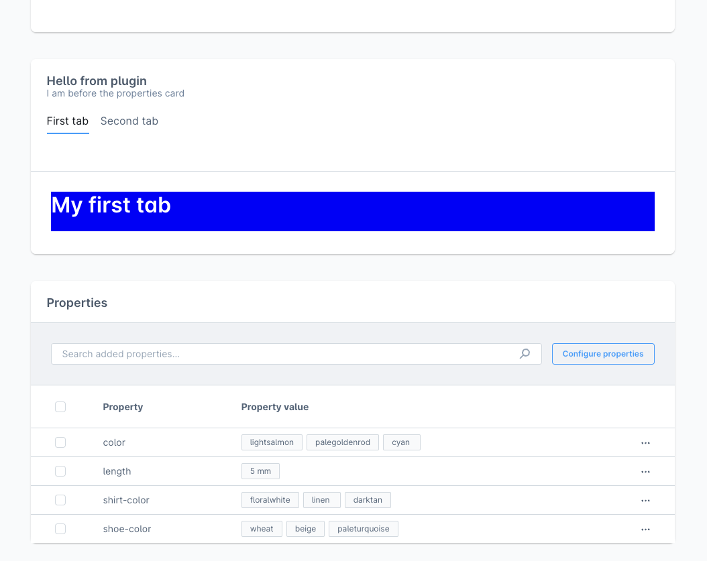

# Component Sections

Component sections allow extensions to render custom UI components inside predefined extension points in the Shopware Administration.

Unlike other extension APIs that modify existing UI elements (such as tabs or buttons), component sections allow extensions to inject full components into specific UI positions.

Component sections are prebuilt (like cards) and usually work together with:

- [Positions](./positions.md): identify where UI can be injected
- [Locations](./locations.md): determine where extension content should render

## Example

```js
if (location.is(location.MAIN_HIDDEN)) {
    sw.ui.componentSection.add({
        // Choose a position id where you want to render a custom component
        positionId: 'sw-manufacturer-card-custom-fields__before',
        // The Component Sections provides different components out of the box
        component: 'card', 
        // Props are depending on the type of component
        props: {
            title: 'Hello from plugin',
            subtitle: 'I am before the properties card',
            // Some components can render a custom view. In this case the extension can render custom content in the card.
            locationId: 'my-app-card-before-properties'
        }
  })
}

// Render the custom UI when the iFrame location matches your defined location
if (sw.location.is('my-app-card-before-properties')) {
    document.body.innerHTML = '<h1>Hello World before</h1>';
    document.body.style.background = 'blue';
}
```


To render tabs inside the `card` component section, we provide a way to do so:

```js
if (sw.location.is(sw.location.MAIN_HIDDEN)) {
  // Choose a position id where you want to render a custom component
  sw.ui.componentSection.add({
      // The Component Sections provides different components out of the box
      component: 'card', 
      // Props are depending on the type of component
      props: {
          title: 'Hello from plugin',
          subtitle: 'I am before the properties card',
          // Render tabs and custom tab content with the provided location id
          tabs: [
              {
                  name: 'example-tab-1',
                  label: 'First tab', 
                  locationId: 'example-tab-1'
              },
              {
                  name: 'example-tab',
                  label: 'Second tab',
                  locationId: 'example-tab-2'
              }
          ],
      }
  })
}

// Render the custom UI for different tab with the location id
if (sw.location.is('example-tab-1')) {
  document.body.innerHTML = '<h1>My first tab</h1>';
  document.body.style.background = 'blue';
}

if (sw.location.is('example-tab-2')) {
  document.body.innerHTML = '<h1>My second tab</h1>';
  document.body.style.background = 'yellow';
}
```


