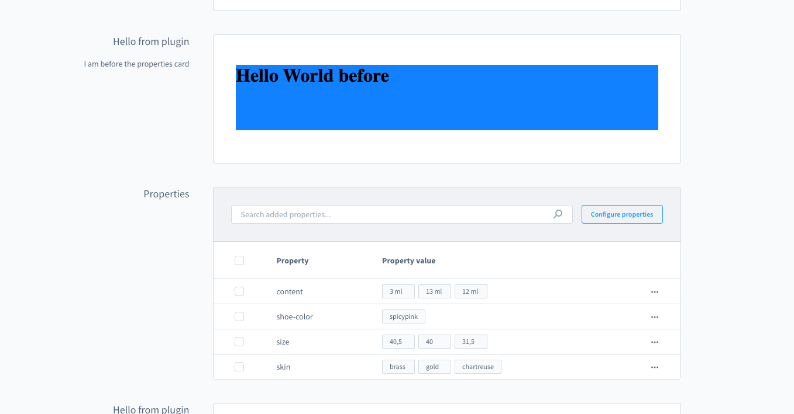

# Component Sections

Component sections allow extensions to render custom UI components inside predefined extension points in the Shopware Administration.

Unlike other extension APIs that modify existing UI elements (such as tabs or buttons), component sections allow extensions to inject full components into specific UI positions.

Component sections are prebuilt (like cards) and usually work together with:

- [Positions](./positions.md): identify where UI can be injected
- [Locations](./locations.md): determine where extension content should render

## Example

This example adds a card with custom content before the properties card on the manufacturer detail page:

```js
import { ui, location } from '@shopware-ag/meteor-admin-sdk';

if (location.is(location.MAIN_HIDDEN)) {
    ui.componentSection.add({
        positionId: 'sw-manufacturer-card-custom-fields__before',
        component: 'card', 
        props: {
            title: 'Hello from plugin',
            subtitle: 'I am before the properties card',
            locationId: 'my-app-card-before-properties'
        }
  })
}

if (location.is('my-app-card-before-properties')) {
    document.body.innerHTML = '<h1>Hello World before</h1>';
}
```



For the full API reference including available components, card properties, and tab support, see the [Component Sections API reference](../api-reference/ui/component-sections.md).
