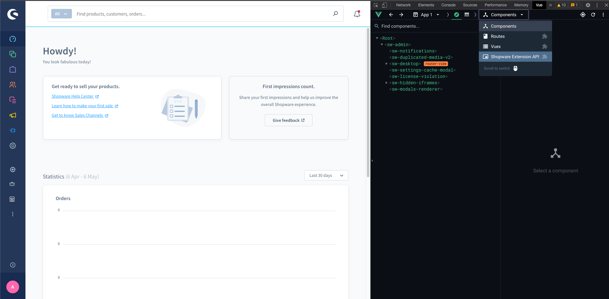
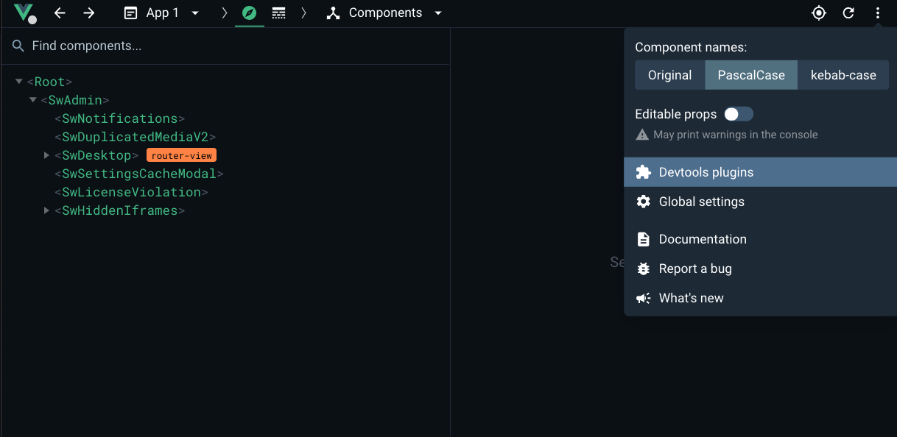
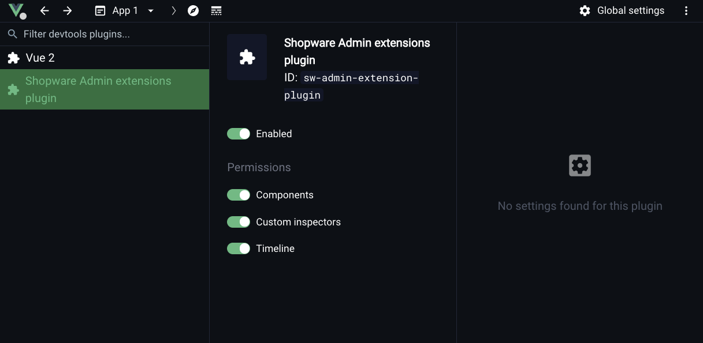
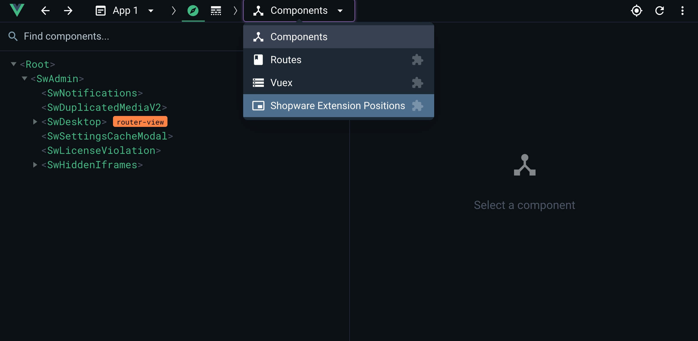
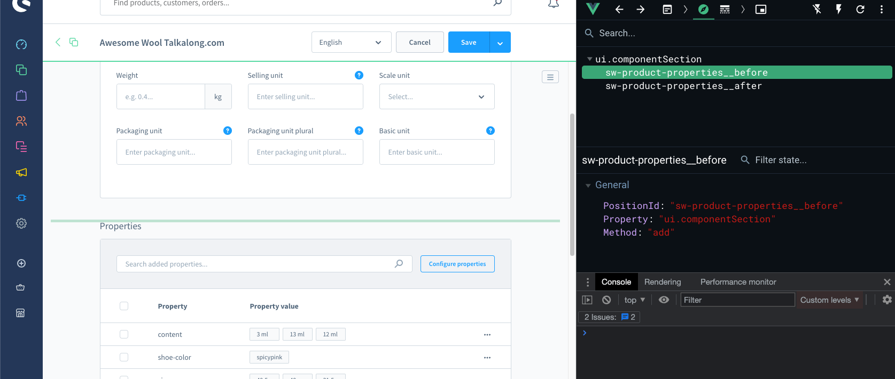

# Finding Extension Points with Vue DevTools

This guide describes the recommended tooling for developing and debugging Administration extensions built with the Meteor Admin SDK.

The Shopware Administration provides many extension points, often implemented as components identified by a unique `positionId`. Identifying the correct `positionId` manually can require searching through the core source code, and can become time-consuming.

A more efficient approach is to use the [Vue DevTools](https://devtools.vuejs.org/) plugin. The Shopware Administration integrates a Shopware Extension API plugin that works with Vue DevTools, enabling interactive discovery of extension points.

Vue DevTools is **optional** but strongly recommended.

## Prerequisites

- A running Shopware instance
- A working app or plugin
- Vue DevTools installed in the browser. This tool is available for Chrome, Firefox, Edge, or as a standalone application, and can be used for inspecting Vue components and extension points inside the Shopware Administration.

The Shopware Extension API plugin for Vue DevTools is available starting with Vue DevTools version 6+ (currently distributed via the [beta channel](https://chrome.google.com/webstore/detail/vuejs-devtools/ljjemllljcmogpfapbkkighbhhppjdbg)). It can be installed alongside older versions. If using a version prior to 6, the plugin will not work.

## 1. Start the Administration watcher

Before inspecting extension points, start the Administration build watcher:

```bash
composer run watch:admin
```

Wait until the compilation finishes successfully. This rebuilds the Administration and enables development mode features.

After installing the browser extension, open the Shopware Administration in development/watch mode.

To verify that the plugin is active, open the DevTools settings and ensure the Shopware Admin plugin is installed and enabled.

## 2. Open the Shopware Extension API plugin

Open the Shopware Administration, then open the browser’s developer tools and navigate to the Vue tab. Select the Shopware Extension API plugin.







## 3. Find extension points

The plugin displays all available extension points for the current page. It is possible to:

- Select an extension point to highlight the corresponding area in the Administration.
- Inspect available properties and metadata.
- Identify where and how to extend the UI using the Meteor Admin SDK.

This helps you to understand:

- Which extension points are available
- What data is exposed
- How the extension interacts with the Administration.


Navigate to the page you want to extend. For example, open the product detail page and switch to the **Specifications** tab.

Open the Shopware Extension API plugin from the Vue DevTools dropdown:



On the left side is a list of available extension points. Selecting one highlights the corresponding area in the Administration.



The DevTools inspector displays additional details about the selected extension point, including:

- The `property` value (referenced in the API documentation)
- The `positionId`, which uniquely identifies the extension location (required in most cases)

Use the `positionId` to target a specific extension point instead of extending all instances globally.
