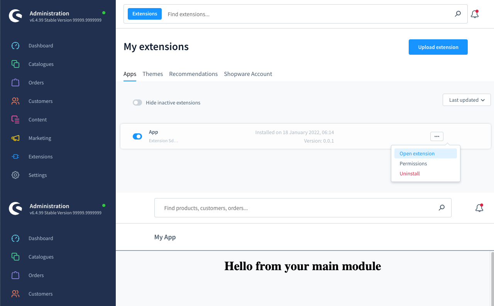

# Main module

### Add main module
Add a main module to your extension. The content of the main module is determined by your `locationId`. 
A specific view or a set of actions can be triggered based on the `locationId`.

#### Usage:  
```ts
ui.mainModule.addMainModule({
    heading: 'My App',
    locationId: 'main-location-id',
});
```

#### Parameters
| Name                    | Required | Default | Description                            |
| :---------------------- | :------- | :------ | :------------------------------------- |
| `heading`               | true     |         | The heading displayed in your module   |
| `locationId`            | true     |         | The Id for the content of the module   |
| `displaySearchBar`      | false    | true    | Toggles the sw-page search bar on/off  |
| `displayLanguageSwitch` | false    | false   | Toggles sw-page language switch on/off |

#### Example

```ts
import { location, ui } from '@shopware-ag/meteor-admin-sdk';

// General commands
if (location.is(location.MAIN_HIDDEN)) {
    // Add the main module
    ui.mainModule.addMainModule({
        heading: 'My App',
        locationId: 'main-location-id',
    });

  // If you want to provide some buttons for the smart bar of your main module
  ui.mainModule.addSmartbarButton({
      locationId: 'main-location-id', // locationId of your main module
      buttonId: 'test-button', // The button id
      label: 'Click me', // The button label
      variant: 'primary', // The button variant
      onClickCallback: () => {}
  });

    ui.mainModule.hideSmartBar({
        locationId: 'main-location-id',
    });
}

// Render your custom view
if (location.is('main-location-id')) {
    document.body.innerHTML = '<h1 style="text-align: center">Hello from your main module</h1>';
}
```

### Add smart bar button to main module
Add a button to the smart bar of your main module. The button can be used to trigger actions, e.g. saving, cancel, etc. The location ID needs to be defined and have the same value as the `locationId` of the main module.

#### Usage:
```ts
ui.mainModule.addSmartbarButton({
    locationId: 'main-location-id', // locationId of your main module
    buttonId: 'test-button', // The button id
    label: 'Click me', // The button label
    variant: 'primary', // The button variant
    onClickCallback: () => {}
});
```

#### Parameters
| Name              | Required | Default   | Description                                                                                                         |
| :---------------- | :------- | :-------- | :------------------------------------------------------------------------------------------------------------------ |
| `locationId`      | true     |           | The locationId of the module you want to display the smart bar button                                               |
| `buttonId`        | true     |           | The id of the button                                                                                                |
| `label`           | true     |           | The label of the button                                                                                             |
| `variant`         | false    | `primary` | Set the variant of the button. Possible values: `primary`, `ghost`, `danger`, `ghost-danger`, `contrast`, `context` |
| `onClickCallback` | true     |           | Callback function which will be called once the button is clicked                                                   |
| `disabled`        | false    | false     | Toggle disabled state of the button                                                                                 |

### Hide smart bar
Turn the smart bar off as needed.

#### Usage:
```ts
ui.mainModule.hideSmartBar({
    locationId: 'main-location-id',
});
```

#### Parameters
| Name         | Required | Default   | Description                                                                                                                                    | Available at Shopware |
| :----------- | :------- | :-------- | :--------------------------------------------------------------------------------------------------------------------------------------------- | :---------------------|
| `locationId` | true     |           | The locationId of the module you want to hide the smart bar                                                                                    | v6.6.7.0               |
