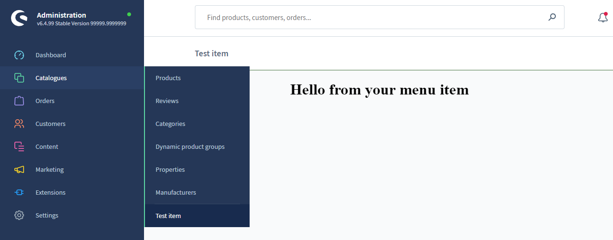

# Menu

### Toggle menu

> Available since Shopware v6.6.2.0

The Admin SDK allows you to manipulate the Admin menu of your application. One of the features it provides is the ability to toggle the Admin menu. This is done using the `collapseMenu` and `expandMenu` methods.

#### Usage:
```ts
ui.menu.collapseMenu(); // To collapse the Admin menu;

ui.menu.expandMenu(); // To expand the Admin menu;
```

### Add menu item
Add a new menu item to the Shopware admin menu. The content of the menu item module is determined by your `locationId`.
A specific view or a set of actions can be triggered based on the `locationId`.

#### Usage:
```ts
ui.menu.addMenuItem({
    label: 'Test item',
    locationId: 'your-location-id',
    displaySearchBar: true,
    displaySmartBar: true,
    parent: 'sw-catalogue',
})
```

#### Parameters
| Name                 | Required | Default        | Description                                                   |
| :------------------- | :------- | :------------- | :------------------------------------------------------------ |
| `label`              | true     |                | The label of the tab bar item                                 |
| `locationId`         | true     |                | The id for the content of the menu item module                |
| `displaySearchBar`   | false    | true           | Toggles the sw-page search bar on/off                         |
| `displaySmartBar`    | false    | true           | Toggles the sw-page smart bar on/off                          |
| `parent`             | false    | 'sw-extension' | Determines under which main menu entry your item is displayed |
| `position`           | false    | 110            | Determines the position of your menu item                     |

#### Example

```ts
import { location, ui } from '@shopware-ag/meteor-admin-sdk';

// General commands
if (location.is(sw.location.MAIN_HIDDEN)) {
    // Add the menu item to the catalogue module
    ui.menu.addMenuItem({
        label: 'Test item',
        displaySearchBar: true,
        displaySmartBar: true,
        locationId: 'your-location-id',
        parent: 'sw-catalogue',
    });
}

// Render your custom view
if (location.is('your-location-id')) {
    document.body.innerHTML = '<h1 style="text-align: center">Hello from your menu item</h1>';
}
```
